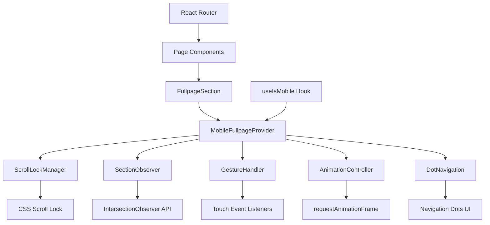

# Design Document: Mobile Fullpage Navigation System

## Overview

The Mobile Fullpage Navigation System is a React-based component that transforms the mobile browsing experience by replacing default scroll behavior with programmatic section navigation. This system provides an Apple-style product showcase experience where users navigate between full-viewport sections using dot navigation and gesture controls.

The system integrates seamlessly with the existing Selarasa website architecture, leveraging the current React Router setup, Tailwind CSS styling, and the existing `useIsMobile` hook for responsive behavior detection.

## Architecture

### High-Level Architecture



### Component Hierarchy

```
App
├── NavbarWrapper
├── Routes
│   └── Page Components (Home, Profil, etc.)
│       └── MobileFullpageProvider (conditional)
│           ├── ScrollLockManager
│           ├── SectionObserver
│           ├── GestureHandler
│           ├── AnimationController
│           └── DotNavigation
│               └── NavigationDot[]
└── Footer
```

## Components and Interfaces

### Core Components

#### 1. MobileFullpageProvider
**Purpose**: Main context provider that orchestrates all fullpage navigation functionality.

```typescript
interface MobileFullpageContextType {
  sections: SectionRef[];
  activeSection: number;
  isAnimating: boolean;
  navigateToSection: (index: number) => void;
  registerSection: (ref: RefObject<HTMLElement>) => void;
  unregisterSection: (ref: RefObject<HTMLElement>) => void;
}

interface MobileFullpageProviderProps {
  children: ReactNode;
  enabled?: boolean;
  animationDuration?: number;
  easingFunction?: string;
}
```

#### 2. FullpageSection
**Purpose**: Wrapper component for individual sections that need fullpage behavior.

```typescript
interface FullpageSectionProps {
  children: ReactNode;
  className?: string;
  id?: string;
}
```

#### 3. DotNavigation
**Purpose**: Fixed navigation component displaying dots for each section.

```typescript
interface DotNavigationProps {
  sections: SectionRef[];
  activeSection: number;
  onNavigate: (index: number) => void;
  isAnimating: boolean;
}

interface NavigationDotProps {
  index: number;
  isActive: boolean;
  onClick: () => void;
  disabled: boolean;
}
```

#### 4. ScrollLockManager
**Purpose**: Manages scroll behavior and CSS properties for mobile devices.

```typescript
interface ScrollLockConfig {
  lockBody: boolean;
  preventTouchMove: boolean;
  preventWheel: boolean;
}
```

#### 5. SectionObserver
**Purpose**: Tracks section visibility using IntersectionObserver API.

```typescript
interface SectionObserverConfig {
  threshold: number;
  rootMargin: string;
}
```

#### 6. GestureHandler
**Purpose**: Processes touch gestures for navigation.

```typescript
interface GestureConfig {
  swipeThreshold: number;
  velocityThreshold: number;
  preventHorizontalSwipe: boolean;
}

interface TouchState {
  startY: number;
  startTime: number;
  isTracking: boolean;
}
```

#### 7. AnimationController
**Purpose**: Manages smooth scroll animations with hardware acceleration.

```typescript
interface AnimationConfig {
  duration: number;
  easing: string;
  useTransform: boolean;
}

interface AnimationState {
  isAnimating: boolean;
  startPosition: number;
  targetPosition: number;
  startTime: number;
}
```

### Data Models

#### SectionRef
```typescript
interface SectionRef {
  ref: RefObject<HTMLElement>;
  id: string;
  index: number;
  position: number;
}
```

#### ViewportState
```typescript
interface ViewportState {
  width: number;
  height: number;
  isMobile: boolean;
  orientation: 'portrait' | 'landscape';
}
```

#### NavigationState
```typescript
interface NavigationState {
  activeSection: number;
  previousSection: number;
  isAnimating: boolean;
  animationProgress: number;
}
```

## Data Models

### Section Management
The system maintains an array of section references with their calculated positions:

```typescript
type SectionRegistry = {
  sections: Map<string, SectionRef>;
  orderedSections: SectionRef[];
  positionCache: Map<string, number>;
}
```

### Animation State
Animation state is managed through a centralized controller:

```typescript
type AnimationQueue = {
  pending: NavigationRequest[];
  current: AnimationState | null;
  completed: NavigationRequest[];
}

type NavigationRequest = {
  targetSection: number;
  trigger: 'click' | 'swipe' | 'keyboard';
  timestamp: number;
}
```

### Gesture Recognition
Touch events are processed through a state machine:

```typescript
type GestureState = 'idle' | 'tracking' | 'evaluating' | 'animating';

type SwipeData = {
  direction: 'up' | 'down' | 'none';
  distance: number;
  velocity: number;
  duration: number;
}
```

## Correctness Properties

*A property is a characteristic or behavior that should hold true across all valid executions of a system-essentially, a formal statement about what the system should do. Properties serve as the bridge between human-readable specifications and machine-verifiable correctness guarantees.*

### Property Reflection

After analyzing all acceptance criteria, I identified several areas where properties can be consolidated to eliminate redundancy:

- **Scroll Prevention Properties (1.1, 1.2, 1.3)**: These all test the same core behavior - preventing default scroll - and can be combined into one comprehensive property
- **CSS Property Management (1.4, 1.5)**: Both test CSS property setting and can be combined
- **Animation Lock Properties (3.4, 3.5, 3.6, 4.4)**: These test the same animation lock mechanism across different triggers and can be consolidated
- **Snap Position Properties (3.7, 4.5, 5.7, 6.2)**: All test final positioning accuracy and can be combined
- **Navigation Trigger Properties (4.1, 4.2, 11.1, 11.2, 11.3, 11.4)**: These test navigation from different input methods but follow the same pattern
- **Section Observer Properties (7.4, 7.5, 7.6)**: These test section registration/unregistration and can be combined
- **Mode Transition Properties (8.6, 8.7)**: Both test responsive mode transitions

### Property 1: Scroll Prevention in Mobile Mode

*For any* touch event, swipe gesture, or scroll event when the mobile navigation system is active, the system SHALL prevent the default browser scroll behavior and maintain the current scroll position.

**Validates: Requirements 1.1, 1.2, 1.3**

### Property 2: CSS Property Management in Mobile Mode

*For any* initial CSS state on the body element, when mobile mode is activated, the system SHALL set overflow to hidden and touch-action to none.

**Validates: Requirements 1.4, 1.5**

### Property 3: Desktop Mode Scroll Preservation

*For any* scroll event when desktop mode is active, the system SHALL allow normal browser scroll behavior without interference.

**Validates: Requirements 1.6, 8.2**

### Property 4: Section-Dot Correspondence

*For any* number of sections rendered, the dot navigation SHALL create exactly one dot per section and maintain this correspondence throughout the component lifecycle.

**Validates: Requirements 2.3, 2.4, 7.3**

### Property 5: Navigation Trigger Response

*For any* valid navigation trigger (dot click, swipe gesture, or keyboard input), the system SHALL navigate to the corresponding section and apply smooth scroll animation.

**Validates: Requirements 3.1, 3.2, 4.1, 4.2, 4.3, 11.1, 11.2, 11.3, 11.4, 11.7**

### Property 6: Animation Timing Constraints

*For any* navigation animation triggered by dot clicks, the animation SHALL complete within 600ms to 800ms using the specified easing function.

**Validates: Requirements 3.3**

### Property 7: Animation Lock Mechanism

*For any* navigation trigger while an animation is in progress, the system SHALL ignore subsequent triggers until the current animation completes, then deactivate the lock.

**Validates: Requirements 3.4, 3.5, 3.6, 4.4, 10.5**

### Property 8: Snap Position Accuracy

*For any* completed navigation animation, the target section SHALL be positioned with pixel-perfect alignment where the section's top edge aligns with the viewport's top edge.

**Validates: Requirements 3.7, 4.5, 5.7, 6.2, 6.3**

### Property 9: Snap Position Calculation

*For any* section that becomes visible, the system SHALL calculate and cache its snap position, ensuring the section height equals 100vh.

**Validates: Requirements 6.1, 6.6**

### Property 10: Responsive Recalculation

*For any* window resize or orientation change event, the system SHALL recalculate snap positions for all sections and invalidate the position cache.

**Validates: Requirements 6.4, 6.5, 12.7**

### Property 11: Intersection Observer Threshold

*For any* section intersection with the viewport, the system SHALL mark the section as active only when it intersects by more than 50%.

**Validates: Requirements 7.2**

### Property 12: Dynamic Section Management

*For any* section added or removed dynamically, the system SHALL update the observer to include new sections or exclude removed sections while maintaining observation of all registered sections.

**Validates: Requirements 7.4, 7.5, 7.6**

### Property 13: Responsive Mode Transitions

*For any* viewport width change that crosses the 769px breakpoint, the system SHALL transition between mobile and desktop modes, updating all relevant behaviors accordingly.

**Validates: Requirements 8.1, 8.6, 8.7**

## Error Handling

### Graceful Degradation Strategy

The system implements a comprehensive fallback strategy to ensure functionality across different browser capabilities and error conditions:

#### Browser API Fallbacks
- **IntersectionObserver**: Falls back to scroll event listeners with throttling for older browsers
- **requestAnimationFrame**: Falls back to setTimeout-based animations with 16ms intervals
- **CSS Transform Support**: Falls back to scroll-based positioning if transforms are unavailable

#### Error Recovery Mechanisms
- **Animation Interruption**: If an animation is interrupted, complete to the nearest snap position
- **JavaScript Errors**: Restore default scroll behavior and disable fullpage navigation
- **Touch Event Failures**: Maintain basic navigation through dot clicks and keyboard
- **Resize Event Failures**: Use cached positions with periodic recalculation attempts

#### Edge Case Handling
- **No Sections**: Disable fullpage navigation and hide dot navigation
- **Single Section**: Render single dot but disable navigation
- **Rapid Triggers**: Use animation lock to prevent race conditions
- **Boundary Navigation**: Ignore swipe gestures at first/last sections

#### Performance Safeguards
- **Memory Leaks**: Proper cleanup of event listeners and observers on unmount
- **Event Throttling**: Debounce resize events (150ms) and throttle scroll events (16ms)
- **Cache Management**: Automatic cache invalidation on viewport changes

### Error State Management

```typescript
interface ErrorState {
  hasError: boolean;
  errorType: 'api_unsupported' | 'animation_failed' | 'observer_failed' | 'unknown';
  fallbackActive: boolean;
  recoveryAttempts: number;
}
```

## Testing Strategy

### Dual Testing Approach

The testing strategy combines property-based testing for core navigation logic with unit tests for specific behaviors and integration tests for browser compatibility.

#### Property-Based Testing
- **Minimum 100 iterations** per property test to ensure comprehensive input coverage
- **Fast-check library** for generating random test inputs (viewport sizes, section counts, gesture patterns)
- **Hardware acceleration testing** using mocked requestAnimationFrame
- **Cross-browser property validation** with different API support levels

Each property test will be tagged with:
**Feature: mobile-fullpage-navigation, Property {number}: {property_text}**

#### Unit Testing Focus
- **Specific examples** of navigation scenarios (first section, last section, single section)
- **Edge cases** like rapid navigation attempts and boundary conditions  
- **Error conditions** such as missing APIs and interrupted animations
- **Accessibility features** including keyboard navigation and ARIA labels

#### Integration Testing
- **Browser compatibility** across different mobile devices and browsers
- **Performance benchmarks** for animation smoothness and memory usage
- **Visual regression testing** for dot navigation positioning and animations
- **Touch gesture accuracy** on real mobile devices

#### Mock Strategy
- **IntersectionObserver**: Mock for testing visibility detection logic
- **requestAnimationFrame**: Mock for controlling animation timing in tests
- **Touch events**: Synthetic touch events for gesture testing
- **Viewport changes**: Mock resize and orientation change events

### Test Configuration

```javascript
// Property test configuration
const propertyTestConfig = {
  numRuns: 100,
  timeout: 5000,
  seed: 42, // For reproducible test runs
  verbose: true
};

// Integration test configuration  
const integrationTestConfig = {
  browsers: ['Chrome', 'Safari', 'Firefox'],
  devices: ['iPhone', 'Android', 'iPad'],
  viewports: [
    { width: 375, height: 667 }, // iPhone SE
    { width: 414, height: 896 }, // iPhone 11
    { width: 360, height: 640 }  // Android
  ]
};
```

## Integration with Existing Selarasa Architecture

### React Router Integration

The mobile fullpage navigation integrates seamlessly with the existing React Router setup:

```typescript
// Enhanced page component structure
const HomePage = () => {
  const isMobile = useIsMobile();
  
  return (
    <div className="page-container">
      {isMobile ? (
        <MobileFullpageProvider>
          <FullpageSection id="hero">
            <HeroSection />
          </FullpageSection>
          <FullpageSection id="values">
            <ValuesSection />
          </FullpageSection>
          <FullpageSection id="cta">
            <CTASection />
          </FullpageSection>
        </MobileFullpageProvider>
      ) : (
        <div className="desktop-layout">
          <HeroSection />
          <ValuesSection />
          <CTASection />
        </div>
      )}
    </div>
  );
};
```

### Navbar Integration

The existing navbar remains functional with enhanced mobile behavior:

```typescript
// Enhanced NavbarWrapper with fullpage awareness
const NavbarWrapper = () => {
  const { activeSection, navigateToSection } = useMobileFullpage();
  const isMobile = useIsMobile();
  
  // Navbar adapts to fullpage navigation context
  return (
    <Navbar 
      fullpageMode={isMobile}
      activeSection={activeSection}
      onSectionNavigate={navigateToSection}
    />
  );
};
```

### Tailwind CSS Integration

The system leverages existing Tailwind classes and extends them for fullpage behavior:

```css
/* Enhanced Tailwind utilities for fullpage navigation */
@layer utilities {
  .fullpage-section {
    @apply h-screen w-full relative overflow-hidden;
  }
  
  .fullpage-locked {
    @apply overflow-hidden;
    touch-action: none;
  }
  
  .dot-navigation {
    @apply fixed right-4 top-1/2 transform -translate-y-1/2 z-50;
    @apply flex flex-col space-y-3;
  }
  
  .navigation-dot {
    @apply w-3 h-3 rounded-full border-2 border-earth-sand/40;
    @apply transition-all duration-300 cursor-pointer;
    @apply hover:border-earth-sand focus:outline-none focus:ring-2 focus:ring-earth-green;
  }
  
  .navigation-dot.active {
    @apply bg-earth-green border-earth-green scale-125;
  }
}
```

### Performance Considerations

#### Memory Management
- **Event Listener Cleanup**: Automatic removal on component unmount
- **Observer Disconnection**: Proper IntersectionObserver cleanup
- **Cache Invalidation**: Automatic cache clearing on viewport changes

#### Animation Optimization
- **Hardware Acceleration**: CSS transforms with `will-change` property
- **Frame Rate Targeting**: 60fps animations using requestAnimationFrame
- **Reduced Motion Support**: Respect user's motion preferences

#### Bundle Size Impact
- **Tree Shaking**: Only import required functionality
- **Lazy Loading**: Load fullpage components only when needed
- **Code Splitting**: Separate mobile and desktop navigation bundles

### Migration Strategy

#### Phase 1: Core Implementation
1. Implement `MobileFullpageProvider` and core hooks
2. Create `FullpageSection` wrapper component
3. Add `DotNavigation` component with basic styling

#### Phase 2: Page Integration
1. Update Home page with fullpage sections
2. Integrate with existing `useIsMobile` hook
3. Test navigation between sections

#### Phase 3: Enhanced Features
1. Add gesture recognition and keyboard navigation
2. Implement animation optimizations
3. Add accessibility features and ARIA labels

#### Phase 4: Performance & Polish
1. Optimize animations and add hardware acceleration
2. Implement comprehensive error handling
3. Add performance monitoring and analytics

### Backward Compatibility

The system maintains full backward compatibility:
- **Desktop Experience**: Unchanged desktop navigation and layout
- **Fallback Behavior**: Graceful degradation for unsupported browsers
- **Progressive Enhancement**: Mobile fullpage navigation as an enhancement layer
- **Existing Components**: No breaking changes to current page components

<function_calls>
<invoke name="prework">
<parameter name="featureName">mobile-fullpage-navigation